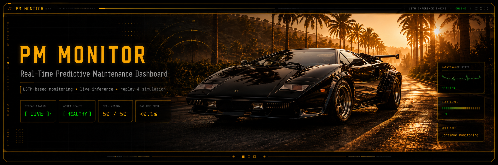
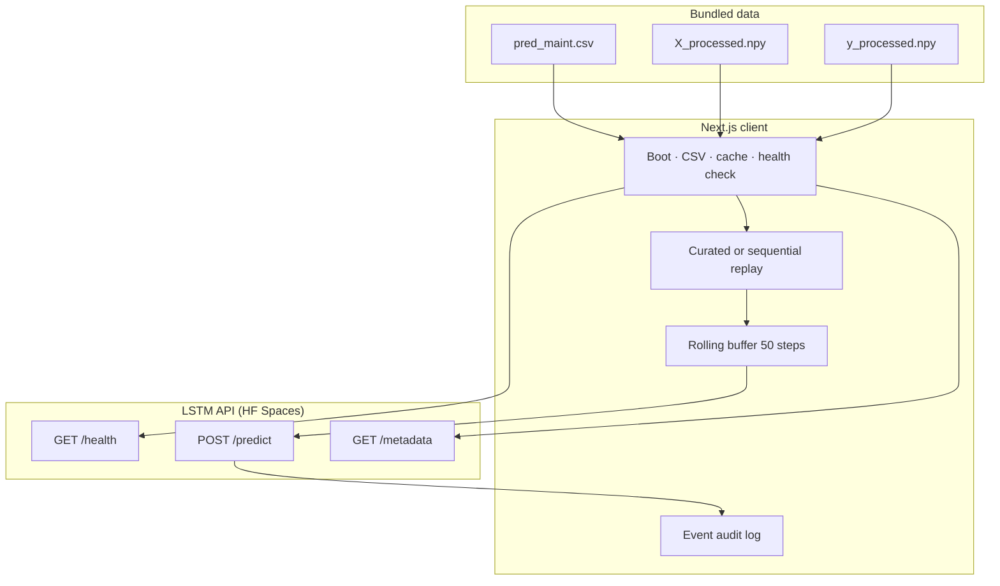

<p align="center">
  
</p>

<h1 align="center">LSTM Predictive Maintenance Dashboard</h1>

<p align="center">
  
</p>

<p align="center">
  <strong>Next.js · TypeScript · Tailwind · Recharts · TensorFlow LSTM API</strong><br />
  <em>1988 Countach blackout console for AI4I failure-risk monitoring, CSV replay, and ground-truth audit.</em>
</p>

<p align="center">
  <a href="https://github.com/sidnei-almeida/lstm-predictive-maintenance-dashboard"><strong>View on GitHub</strong></a>
  &nbsp;·&nbsp;
  <a href="https://salmeida-predictive-maintenance-lstm.hf.space">LSTM Inference API</a>
  &nbsp;·&nbsp;
  <a href="https://salmeida-predictive-maintenance-lstm.hf.space/docs">API docs (OpenAPI)</a>
  &nbsp;·&nbsp;
  <a href="https://archive.ics.uci.edu/ml/datasets/AI4I+2020+Predictive+Maintenance+Dataset">AI4I Dataset (UCI)</a>
</p>

<p align="center">
  
  
  
  
  
  
  
  
  
  
</p>

---

## Executive summary

This repository is a **production-style predictive maintenance console** for rotating industrial equipment. It streams the **AI4I 2020** dataset as if it were live IoT telemetry, maintains a rolling **50-step LSTM input window**, and queries a deployed **TensorFlow LSTM** for continuous **failure probability** (0–100%).

The interface is deliberately **not** a generic admin template: it mimics a **1988 Lamborghini Countach / blackout tiling manager** — black glassless panels, 1px grids, VFD phosphor readouts (amber · green · gray), and monospace diagnostic typography suitable for long monitoring sessions.

| | |
|---|---|
| **Rows in replay** | 10,000 (`pred_maint.csv`) |
| **Machine failures (ground truth)** | 339 (**3.39%**) — highly imbalanced |
| **LSTM input tensor** | `[50 × 7]` per inference |
| **Maintenance threshold** | **50%** failure probability |
| **Default API** | Hugging Face Spaces FastAPI |

---

## What this is

A **full-stack predictive maintenance operations dashboard** that:

1. Loads **raw CSV** for human-readable sensor display and audit trails.
2. Loads **preprocessed NumPy tensors** (`X_processed.npy`, `y_processed.npy`) for model payloads and ground-truth comparison.
3. Replays historical rows on a timer as a **simulated machine stream** (curated demo or sequential).
4. Calls **`POST /predict`** on every full sequence window — the browser never ships model weights.

It is the modern successor to **[PulseBridge](https://github.com/sidnei-almeida/sidnei-almeida.github.io/tree/main/projects/predictive-maintenance)** (static HTML + gauge UI), with the **same inference endpoint**, plus dataset analytics, event audit, and simulation controls.

> **Inference API (default):** `https://salmeida-predictive-maintenance-lstm.hf.space`

---

## Dataset at a glance (AI4I 2020)

Bundled file: `data/pred_maint.csv` — synthetic predictive maintenance records for **10,000** production runs.

| Metric | Value |
|--------|------:|
| Total samples | **10,000** |
| Normal (`Machine failure = 0`) | **9,661** (96.61%) |
| Machine failure (`= 1`) | **339** (3.39%) |
| Class imbalance | ≈ **1 : 28.5** (failure : normal) |
| Inference-ready windows (from row 50) | **9,951** |

### Product types

| Type | Samples | Failures | Failure rate |
|------|--------:|---------:|-------------:|
| **L** (low variant) | 6,000 | 235 | 3.92% |
| **M** (medium) | 2,997 | 83 | 2.77% |
| **H** (high) | 1,003 | 21 | 2.09% |

### Failure mode flags (ground-truth context only)

These labels describe *why* a failure occurred. They are **not** LSTM inputs — the model sees only the seven sensor features below.

| Mode | Meaning (AI4I) | Occurrences |
|------|----------------|------------:|
| **TWF** | Tool wear failure | 46 |
| **HDF** | Heat dissipation failure | 115 |
| **PWF** | Power failure | 95 |
| **OSF** | Overstrain failure | 98 |
| **RNF** | Random failure | 19 |

> Mode counts can exceed machine-failure count when multiple flags co-occur; some failure rows have no mode flag (dataset quirk documented in Analytics).

### Sensor operating ranges (raw CSV)

| Signal | Min | Max | Unit |
|--------|----:|----:|------|
| Air temperature | 295.3 | 304.5 | K |
| Process temperature | 305.7 | 313.8 | K |
| Rotational speed | 1,168 | 2,886 | rpm |
| Torque | 3.8 | 76.6 | Nm |
| Tool wear | 0 | 253 | min |

---

## Model & inference pipeline



| Item | Detail |
|------|--------|
| **Architecture** | LSTM sequence classifier (TensorFlow) |
| **Input shape** | `50 timesteps × 7 features` |
| **Features** | `air_temperature_k`, `process_temperature_k`, `rotational_speed_rpm`, `torque_nm`, `tool_wear_min`, `type_l`, `type_m` |
| **Output** | Continuous **failure probability** ∈ [0, 1] |
| **Threshold** | **0.5** raw → **50%** UI maintenance band |
| **Elevated watch** | ≥ **40%** (warning band before threshold) |
| **Payload source** | Pre-normalized rows from `X_processed.npy` |
| **API state** | Stateless — client owns sequence construction |

### Risk interpretation (UI)

| Probability | Model verdict | Typical UI action |
|-------------|---------------|-------------------|
| &lt; 40% | **Healthy** | Continue monitoring |
| 40% – 49% | **Elevated risk** | Watch sensors / trend |
| ≥ 50% | **Failure risk** | Maintenance review recommended |

Predictions are **model-derived**. Ground-truth labels from `y_processed.npy` are shown for audit and mismatch detection only.

### Example `/predict` request

```json
{
  "sequence": [
    [0.12, 0.45, 0.33, 0.21, 0.08, 1, 0],
    "... 48 more timesteps ..."
  ]
}
```

Each inner array is one timestep with **7 floats** (same order as `FEATURE_ORDER` in `src/lib/features/constants.ts`).

---

## Pages & workflow

| Route | Purpose |
|-------|---------|
| **Dashboard** `/` | Live KPIs, pipeline strip, asset health, failure probability trend, sequence buffer, risk drivers, maintenance decision, event log |
| **Dataset & Model Analytics** `/analytics` | AI4I profile, sensor stats, failure-mode charts, LSTM schematic, feature schema, model spec plate, API metadata |
| **Alerts / History** `/alerts` | Filterable audit table, risk timeline, session review, hardware diagnostic event terminal |
| **Simulation** `/simulation` | Replay mode, stream transport, buffer/API status |

### Recommended operator flow

1. **Boot** — wait for CSV, processed cache, and API health (cold-start aware).
2. **Stream** — start curated demo or sequential replay from Simulation or topbar.
3. **Monitor** — watch probability trend, buffer fill (`50/50`), and maintenance decision card.
4. **Inject** — force a **50-row failure-adjacent window** (historical context, not a single row).
5. **Audit** — open Alerts, filter by prediction/ground truth, inspect terminal-style event details.

---

## Main features

### Real-time operations dashboard

- **Boot sequence** with phased status (CSV → processed tensors → API)
- **KPI strip** — packets processed, probability, threshold, ground truth, stream/API state
- **Failure probability trend** — step-after green trace, square markers, 50% threshold line
- **Sequence buffer** — visual fill for LSTM window readiness
- **Risk drivers** — heuristic stress factors (tool wear, torque, temperature gap)
- **Maintenance decision** — verdict + recommended action from model probability
- **Event log** — streaming audit of replay, predictions, alerts, and API calls

### Dataset & model analytics

- Class distribution and **failure rate by product type**
- Sensor distributions, comparisons (normal vs failure), torque–speed scatter
- **Model overview spec plate** — tensor `[ 50 × 7 ]`, threshold bar, API LED
- **LSTM cell schematic** — educational gate diagram (pure HTML/CSS)
- **Feature schema register array** — seven inputs + null register slot
- **API contract** — `/health`, `/predict`, `/metadata` field expectations

### Alerts & audit trail

- Sortable history: time, packet, prediction, probability, threshold, GT, failure modes
- **Hardware diagnostic terminal** for selected events (VFD color coding)
- Session prediction review vs ground truth
- Model probability timeline for the replay session
- Filters: prediction band, GT, failure mode (TWF…RNF), event type, min probability

### Simulation control center

| Mode | Behavior |
|------|----------|
| **Curated demo** | Deterministic path: normal → degradation → failure-adjacent → recovery (real row indices) |
| **Sequential** | Linear CSV order from index **50** (first full LSTM window) |
| **Inject failure** | Cycles through **8** curated failure indices; replays full **50-step** context |

Default tick: **1000 ms** (`NEXT_PUBLIC_REPLAY_INTERVAL_MS`).

---

## Design system

Built for control-room monitoring — no glassmorphism, no rounded SaaS cards.

| Element | Implementation |
|---------|----------------|
| **Theme** | Countach 1988 blackout — `#000000` panels, `#222` / `#333` grid |
| **Logo** | `PmMonitorLogo` SVG — industrial cog (`public/images/pm-logo.svg`) |
| **Typography** | `font-mono` + `leading-tight` on telemetry |
| **VFD palette** | Amber `#ffaa00` · Green `#00ff00` · Gray `#888888` |
| **Charts** | `vfd-telemetry` Recharts theme — plot `#141414` |
| **Status** | Topbar: **API LSTM Live** · **API Simulated** · **API Offline** |

Tokens: `src/app/globals.css`, `src/lib/theme/tokens.ts`, `src/lib/charts/vfd-telemetry.ts`.

---

## Tech stack

| Layer | Choice |
|-------|--------|
| Framework | Next.js 16 (App Router) |
| Language | TypeScript |
| Styling | Tailwind CSS v4 |
| State | Zustand |
| Charts | Recharts 3 |
| CSV | PapaParse |
| Tensors | NumPy → `data/.cache/processed.bin` |
| Inference | REST → Hugging Face Spaces FastAPI |

---

## Prerequisites

- **Node.js** 20+
- **npm** (or pnpm / yarn)
- **Python 3** + `numpy` — only to rebuild `processed.bin`
- Network access to the LSTM API (or local FastAPI with CORS)

---

## Environment variables

All settings use the `NEXT_PUBLIC_` prefix (embedded in the client bundle at build time on Vercel).

| Variable | Required | Default | Description |
|----------|----------|---------|-------------|
| `NEXT_PUBLIC_PRED_MAINT_API_URL` | No | `https://salmeida-predictive-maintenance-lstm.hf.space` | LSTM FastAPI base URL |
| `NEXT_PUBLIC_REPLAY_INTERVAL_MS` | No | `1000` | CSV replay interval (ms) |
| `NEXT_PUBLIC_DEBUG_INFERENCE` | No | `false` in prod | `true` → `/predict` debug logs + panel |

`NODE_ENV` is set automatically by Vercel.

```bash
cp .env.example .env.local
```

**Local FastAPI** (uvicorn `:7860` with CORS):

```env
NEXT_PUBLIC_PRED_MAINT_API_URL=http://localhost:7860
```

---

## Quick start

```bash
git clone https://github.com/sidnei-almeida/lstm-predictive-maintenance-dashboard.git
cd lstm-predictive-maintenance-dashboard

npm install
cp .env.local.example .env.local

# Optional: regenerate binary tensor cache (requires numpy)
npm run data:cache

npm run dev
```

Open [http://localhost:3000](http://localhost:3000).

1. Wait for the **boot screen** (CSV → cache → `/health`).
2. Click **Stream** or open **Simulation** → start replay.
3. Use **Inject** to push a failure-adjacent historical window through the model.
4. Open **Alerts** to audit predictions vs ground truth.

> **Cold start:** Hugging Face Spaces free tier may take **30–60 seconds** on first `/health`. The UI reports wake-up status during boot.

### Production build

```bash
npm run build   # runs ensure-processed-cache.mjs
npm start
```

---

## Deploy on Vercel

1. Import the repository on [Vercel](https://vercel.com) — preset **Next.js**.
2. **Settings → Environment Variables** (Production + Preview + Development):

| Name | Recommended value |
|------|-------------------|
| `NEXT_PUBLIC_PRED_MAINT_API_URL` | `https://salmeida-predictive-maintenance-lstm.hf.space` |
| `NEXT_PUBLIC_REPLAY_INTERVAL_MS` | `1000` |
| `NEXT_PUBLIC_DEBUG_INFERENCE` | `false` |

3. Commit **`data/pred_maint.csv`**, **`X_processed.npy`**, **`y_processed.npy`**, and **`data/.cache/processed.bin`** (~290 KB, required — Vercel has no Python/NumPy at build).
4. Deploy. Icons: `src/app/icon.svg`, `favicon.ico`, `apple-icon.png`, `public/icons/*`.

To regenerate the cache locally: `npm run data:cache` then `git add -f data/.cache/processed.bin`.

> First load may take **30–60 s** while Hugging Face Spaces cold-starts; the boot overlay retries `/health` automatically.

---

## Repository structure

```
lstm-predictive-maintenance-dashboard/
├── data/
│   ├── pred_maint.csv              # 10k AI4I rows (~510 KB)
│   ├── X_processed.npy             # LSTM features [10000 × 7]
│   ├── y_processed.npy             # Labels [10000]
│   └── .cache/processed.bin        # Fast boot cache (generated)
├── images/
│   ├── header.png                  # README hero banner
│   └── lambologo.png               # Dashboard hero asset
├── public/images/
│   ├── pm-logo.svg                 # Sidebar / brand mark
│   └── lambologo.png
├── scripts/
│   ├── build-processed-cache.py
│   └── ensure-processed-cache.mjs
├── src/
│   ├── app/                        # Routes + /api/* handlers
│   ├── components/
│   │   ├── dashboard/              # Live ops
│   │   ├── analytics/              # Dataset & model views
│   │   ├── alerts/                 # History & event terminal
│   │   ├── simulation/             # Replay controls
│   │   └── layout/                 # Shell, sidebar, hero, logos
│   ├── lib/                        # API, events, replay, charts
│   └── store/maintenance-store.ts  # Stream + inference state
├── public/icons/                   # PWA 192 / 512 (cog mark)
├── public/site.webmanifest
├── readme_model.md                 # README style reference
├── .env.example                    # Vercel + local reference
└── .env.local.example
```

---

## API surface

| Endpoint | Method | Role |
|----------|--------|------|
| `/health` | GET | Model/data loaded, TensorFlow availability |
| `/predict` | POST | Sequence in → failure probability out |
| `/metadata` | GET | Model version, features, training summary |

**Default host:** [salmeida-predictive-maintenance-lstm.hf.space](https://salmeida-predictive-maintenance-lstm.hf.space)

The UI parses `predicted_probability` → `probability` → `prediction_probability` and **ignores** binary class fields for the gauge.

---

## Event types (audit log)

| Type | Source examples |
|------|-----------------|
| `stream` | CSV row replayed, buffer updated, curated segment entered |
| `prediction` | LSTM prediction processed |
| `alert` | Threshold crossed, known failure row, maintenance risk |
| `api` | Health/metadata errors, missing probability |
| `user` | Inject failure, replay mode change |
| `dataset` | CSV / processed data loaded |
| `system` | Boot milestones |

---

## Related projects

| Project | Role |
|---------|------|
| [salmeida-predictive-maintenance-lstm](https://huggingface.co/spaces/salmeida/predictive-maintenance-lstm) | TensorFlow LSTM + FastAPI |
| [PulseBridge (legacy)](https://github.com/sidnei-almeida/sidnei-almeida.github.io/tree/main/projects/predictive-maintenance) | Original static HTML dashboard |
| [AI4I 2020 (UCI)](https://archive.ics.uci.edu/ml/datasets/AI4I+2020+Predictive+Maintenance+Dataset) | Source dataset documentation |
| **This repo** | Next.js operations console & audit UI |

---

## Disclaimer

Failure probabilities and maintenance recommendations are for **education, reliability workshops, and model validation** only. They are not certified safety systems, OEM service bulletins, or guarantees of equipment failure. Always validate alerts with plant procedures and physical inspections.

---

## Author

**Sidnei Alves de Almeida** — [@sidnei-almeida](https://github.com/sidnei-almeida)
